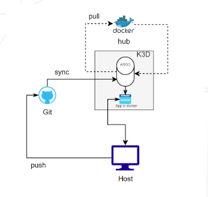

# Inception of Things

This is the personal repo,

Group project finalized [HERE](https://github.com/ychun816/Inception-of-Things2) (collab with @hsharame )

---


# Index

- [Project Structure](#project-structure)
- [Project repos](#project-repos)
       - [p1 Basic Setup (2VMS)](#p1-basic-setup-2vms)
       - [p2 (1VM / 1 ingress)](#p2-1vm--1-ingress)
       - [p3 continuous integration | K3d and Argo CD](#p3-continuous-integration--k3d-and-argo-cd)
- [Other principle concepts](#otehrr-principle-concepts)
       - [Kubernetes principle structure /feature](#kubernetes-principle-structure-feature)
- [Summary](#summary)
       - [docker / k8s / k3s / k3d // terrafrom / vagrant // ansible](#docker--k8s--k3s--k3d--terrafrom--vagrant--ansible)
       - [k3s vs k3d](#k3s-vs-k3d)
- [Documentations](#documentations)
       - [prestart](documentations/PRESTART.md)
       - [k8s](documentations/K8.md)
       - [Vagrant](documentations/VAGRANT.md)
       - [k3s](documentations/K3S.md)
       - [k3d](documentations/K3D.md)
       - [Argo CD](documentations/ARGOCD.md)

---

## Project Structure

```bash
├── p1/                         # Part 1: K3s & Vagrant (2 VMs)
│   ├── Vagrantfile             # Defines 2 VMs (Server + Worker)
│   └── scripts/
│       └── install_k3s.sh      # Installation logic
│
├── p2/                         # Part 2: K3s & Ingress (1 VM)
│   ├── Vagrantfile             # Defines 1 VM (Server)
│   ├── scripts/
│   │   └── k3s-server.sh
│   └── confs/
│       ├── app1/                # app => pod
│       │   ├── deployment.yaml
│       │   └── service.yaml
│       ├── app2/
│       │   ├── deployment.yaml
│       │   └── service.yaml
│       ├── app3/
│       │   ├── deployment.yaml
│       │   └── service.yaml
│       └── ingress.yaml
│
└── p3/                         # Part 3: K3d & ArgoCD (Local/VM Script)
    ├── install.sh              # Installs Docker, K3d, ArgoCD CLI
    ├── setup.sh                # Creates cluster, namespaces, apps
    └── config/                 # Manifests for ArgoCD
```

*Note: For Part 3, also need a separate **GitHub Repository** (online) that contains the actual deployment files for your app, which ArgoCD will watch.*


---

## Project repos

### p1 Basic Setup (2VMS)

```bash
vagrant --version

# Bring up the VMs
vagrant up

# Verify the Cluster:
# Once vagrant up finishes, log into the Server node and check if both nodes are ready:
vagrant ssh yilinS
sudo kubectl get nodes


# no space 
1. Create a folder in goinfre:
mkdir -p /goinfre/yilin/vagrant_home
2. Set the environment variable (temporary for this session):
export VAGRANT_HOME=/goinfre/yilin/vagrant_home
3. Try vagrant up again:
vagrant up

# (Optional) Make it permanent:
echo 'export VAGRANT_HOME=/goinfre/yilin/vagrant_home' >> ~/.zshrc
source ~/.zshrc

# set in goinfre
VBoxManage setproperty machinefolder /goinfre/yilin/virtualbox_vms

```

---

### p2 (1VM / 1 ingress) 

> Deployment = manages pods (your app instances)
> Service = stable access point to those pods


---

### p3 continuous integration | K3d and Argo CD



- k3d_install.sh : Installs Docker, k3d, kubectl, and jq (prerequisites)
- create_nodes.sh : Creates the k3d cluster, namespaces, and deploys the application

#### workflow
1. Run `k3d_install.sh`  
       → Installs Docker, k3d, kubectl, jq
2. Run `create_nodes.sh`  
       → Creates k3d cluster, namespaces, and deploys your app
3. (Optional) Set up Argo CD in `argocd` namespace  
       → Connects Argo CD to your GitHub repo
4. Argo CD syncs manifests from GitHub  
       → Deploys to `dev` namespace
5. K3d pulls Docker images from Docker Hub  
       → Runs your app as pods
6. Access your app on the host  
       → via exposed ports

---

# Otehrr principle concepts

## Kubernetes principle structure /feature


## Kubernetes Best Practice: Modularity

- In Kubernetes, it is best practice to keep resources modular. 
- Each resource (Deployment, Service, Ingress, etc.) should be defined as a separate YAML object. 
- This makes setup more maintainable, reusable, and easier to update or troubleshoot. 

- **Deployment**: Manages app's pods (how many, what image, update strategy, etc.).
- **Service**: Provides a stable network endpoint to access app's pods, even as pods are created, destroyed, or moved.
- **Ingress**: Routes external traffic to services.

> You can group related YAMLs in the same file (separated by `---`), but each resource must remain its own object.

---

# Summary
## docker / k8s / k3s / k3d // terrafrom / vagrant // ansible

| Group                                | Tool                 | Purpose                               | Scope                          | Key Features                                                             | Typical Use Cases                                                 | Analogy                                             |
| ------------------------------------ | -------------------- | ------------------------------------- | ------------------------------ | ------------------------------------------------------------------------ | ----------------------------------------------------------------- | --------------------------------------------------- |
| **Containerization & Orchestration** | **Docker**           | Build and run containers              | Single host or multi-host      | Lightweight virtualization; image management; container isolation        | Package apps with dependencies; microservices; dev/test           | A “box” to hold your app                            |
|                                      | **Kubernetes (K8s)** | Orchestrate containers                | Cluster of multiple nodes      | Automatic scaling, self-healing, load balancing, service discovery       | Production-grade container clusters; microservices at scale       | The “traffic manager” for many Docker boxes         |
|                                      | **K3s**              | Lightweight Kubernetes                | Small clusters, edge, IoT      | Minimal resource usage; single binary; SQLite support; ARM compatible    | Edge computing; small clusters; lightweight K8s                   | A small, portable K8s server                        |
|                                      | **K3d**              | K3s in Docker                         | Local development environments | Runs K3s inside Docker; fast setup; easy cluster reset                   | Local testing; CI/CD pipelines; dev learning clusters             | Put the small K8s server **inside Docker boxes**    |
| **Infrastructure Provisioning**      | **Terraform**        | Infrastructure as Code (IaC)          | Multi-cloud / on-prem          | Declarative provisioning of VMs, networks, cloud resources               | Provision cloud resources; reproducible infra; multi-cloud setups | Blueprint to build your environment                 |
|                                      | **Vagrant**          | VM management                         | Local dev environment          | Create/manage reproducible VMs; integrates with VirtualBox, VMware, etc. | Dev environments; testing multiple OS/VMs locally                 | A “sandbox” to quickly spin up dev machines         |
| **Configuration & Automation**       | **Ansible**          | Configuration management & automation | Multi-host / multi-tier        | Agentless; push-based; YAML playbooks; idempotent                        | Install/configure software; deploy apps; manage servers           | A “robot” that sets up and configures your machines |

| 分類         | 工具                   | 目的             | 範圍            | 主要功能                                | 典型使用情境                   | 類比                         |
| ---------- | -------------------- | -------------- | ------------- | ----------------------------------- | ------------------------ | -------------------------- |
| **容器化與編排** | **Docker**           | 建立與運行容器        | 單一主機或多主機      | 輕量虛擬化；映像檔管理；容器隔離                    | 打包應用程式及依賴；微服務；開發/測試      | 裝應用程式的「箱子」                 |
|            | **Kubernetes (K8s)** | 容器編排           | 多節點叢集         | 自動擴展、自我修復、負載均衡、服務發現                 | 生產環境容器叢集；大規模微服務管理        | 管理許多 Docker 箱子的「交通指揮官」     |
|            | **K3s**              | 輕量級 Kubernetes | 小型叢集、邊緣運算、物聯網 | 資源需求低；單一二進位檔；內建 SQLite 支援；支援 ARM 架構 | 邊緣運算；小型叢集；輕量級 Kubernetes | 小型、可攜帶的 K8s 伺服器            |
|            | **K3d**              | Docker 中的 K3s  | 本地開發環境        | 在 Docker 中運行 K3s；快速建立叢集；易於重置        | 本地測試 K3s；CI/CD 管線；開發學習叢集 | 將小型 K8s 伺服器「放進 Docker 箱子裡」 |
| **基礎設施建置** | **Terraform**        | 基礎設施即程式碼 (IaC) | 多雲 / 本地       | 宣告式建立虛擬機、網路、雲端資源；支援多種供應商            | 建置雲端資源；可重現的基礎設施；多雲環境管理   | 建立環境的「藍圖」                  |
|            | **Vagrant**          | 虛擬機管理          | 本地開發環境        | 建立/管理可重現的虛擬機；支援 VirtualBox、VMware 等 | 開發環境建立；本地測試多種 OS / VM    | 快速建立開發機的「沙盒」               |
| **配置與自動化** | **Ansible**          | 配置管理與自動化       | 多主機 / 多層架構    | 無代理；推送式管理；YAML Playbook；可重複執行       | 安裝/配置軟體；部署應用程式；伺服器管理     | 幫你設定與配置機器的「機器人」            |

---

## k3s vs k3d 

| Concept | Analogy                                                                  |
| ------- | ------------------------------------------------------------------------ |
| K3s     | A small Kubernetes server (the “worker and manager” of containers)       |
| K3d     | A “containerized launcher” that spins up K3s servers inside Docker boxes |

- Production / Edge / Server Deployment:
> K3s = the “mini boss” that actually manages containers, workloads, and services.
> K3d = a helper tool that runs K3s inside Docker for convenience, speed, and local testing.
> In production, you use K3s directly; K3d is not needed.
> In dev/test, K3d accelerates cluster setup inside Docker.


```
┌──────────────┐
│    K3s       │  <- Lightweight Kubernetes cluster
│ (mini boss)  │
└──────────────┘
     ↑
     │  Directly installed on VM, server, or edge device
     │
(No K3d needed)

Local Development / Testing / CI:
┌──────────────┐
│   Docker     │  <- Provides container platform
└──────┬───────┘
       │
┌──────▼───────┐
│   K3d        │  <- Helper tool, spins up K3s inside Docker
│ (helper /    │
│  accelerator)│
└──────┬───────┘
       │
┌──────▼───────┐
│   K3s        │  <- Lightweight Kubernetes cluster
│ (mini boss)  │
└──────────────┘
```

---

