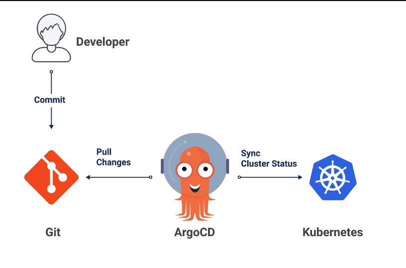
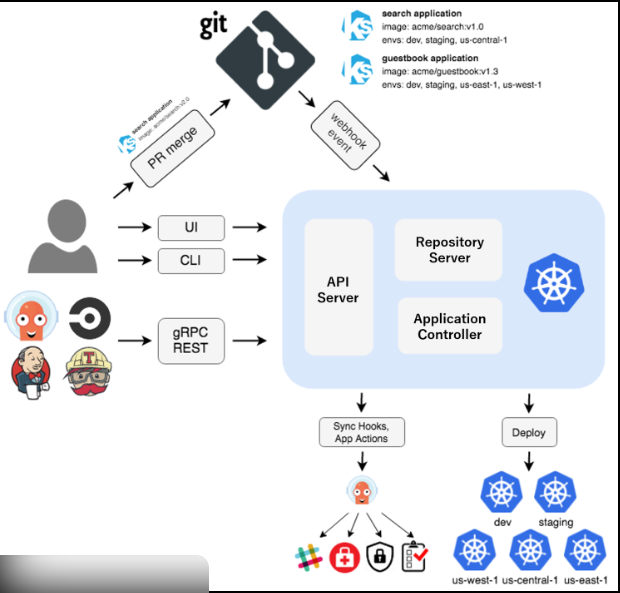

# Argo CD

## resources 

- [overview](https://argo-cd.readthedocs.io/en/stable/)
- [What is ArgoCD](https://www.youtube.com/watch?v=p-kAqxuJNik)
- [ArgoCD Tutorial for Beginners | GitOps CD for Kubernetes](https://www.youtube.com/watch?v=MeU5_k9ssrs)


---
- Argo CD is a **GitOps continuous delivery tool** for Kubernetes.
- Argo CD works ONLY with Kubernetes.
- Argo CD is a declarative, GitOps-based continuous delivery (CD) tool designed specifically for Kubernetes.
- It continuously:
    - Watches a Git repository
    - Detects changes
    - Applies Kubernetes manifests to cluster

- GitOps Principle
```
Git = Source of Truth
Cluster = Should match Git
Argo CD = Enforcer
```

- If something changes manually in the cluster:
    - Argo detects drift
    - Syncs back to match Git


> If something is defined in Git, Argo CD makes sure Kubernetes cluster matches it.

> If Kubernetes is: The system that runs containers
> Then Argo CD is: The system that ensures Kubernetes always matches what is written in Git
> And GitOps is: The philosophy that Git controls everything


### workflow 

1. build Docker image
2. Push image to Docker Hub
3. Update Kubernetes YAML in Git
4. Push to Git
5. Argo CD detects change
6. Argo CD applies to K3d
7. Cluster pulls image
8. App runs
9. access app from Host
- Docker Hub stores images
- Cluster pulls images from Docker Hub

```
Developer → push → Git
              ↓
         Argo CD sync
              ↓
          K3d cluster
              ↓
           Host access
```

---

## summary 

| Traditional CD                         | GitOps (Argo CD)             |
| -------------------------------------- | ---------------------------- |
| CI pipeline pushes directly to cluster | Git is updated               |
| CI needs cluster credentials           | Argo CD lives inside cluster |
| Harder to audit                        | Git history = full audit log |
| Manual drift possible                  | Auto drift detection         |
| Imperative                             | Declarative                  |







## CONCEPTS TO STUDY:

[] namespace
[] Kubernetes manifests
- 
