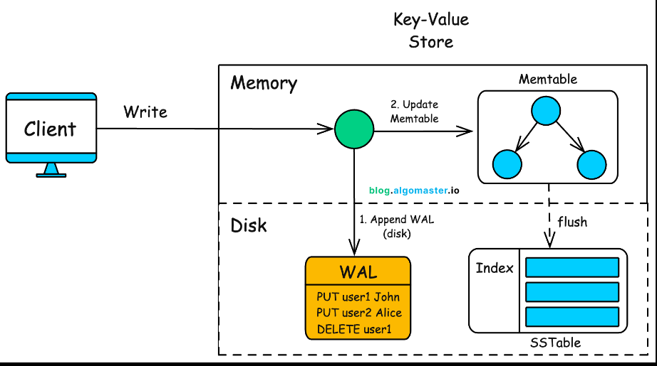
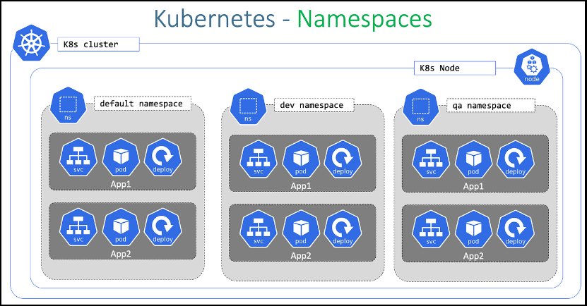
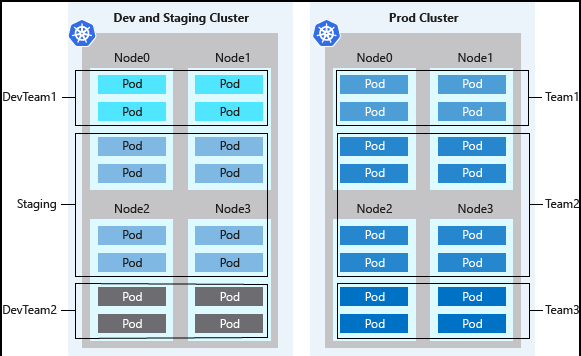
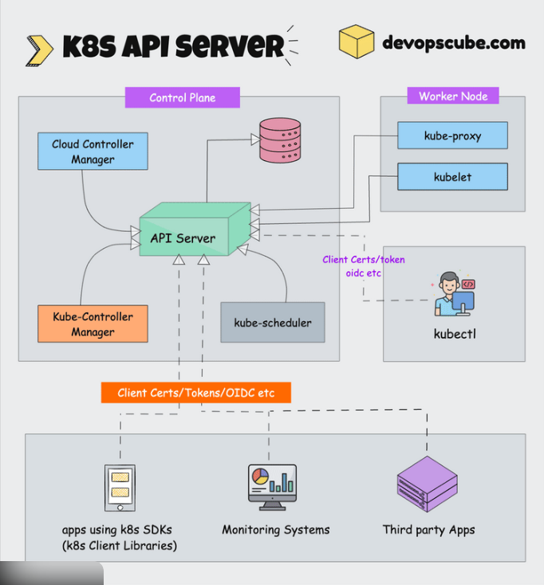
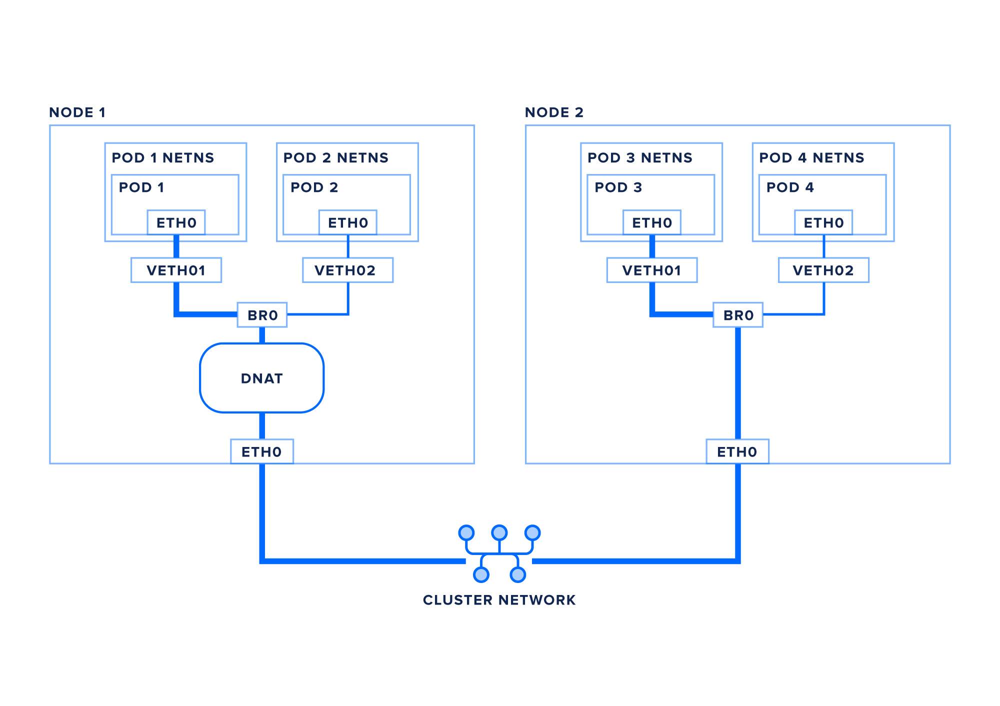

# k8

## general concept, what's k8? 

Kubernetes (K8s) is a container orchestration platform.
It automatically manages, deploys, scales, and maintains containerized applications across multiple machines.

Instead of manually running containers on servers, Kubernetes:
- Decides where containers run
- Restarts them if they crash
- Scales them up/down
- Manages networking between them
- Stores configuration and secrets
> It turns a group of machines into a cluster that behaves like one powerful system.

---

## structure/archintecture
- docker
- containter runtime : software that actually runs containers
- pod
- node
- cublet
- cube proxy
- control plane (controller manager / scheduler / ETCD / API server)
- control plane 
- master node 
- server node
- worker node
- agent node 


### containter runtime
the software that actually runs containers.
Kubernetes does not directly run containers.
It talks to the container runtime via CRI (Container Runtime Interface).

### pod

A Pod is the smallest deployable unit in Kubernetes.
- Contains one or more containers
- Containers inside a pod share:
 - Network (same IP)
 - Storage
- Usually 1 container per pod (best practice)
> like a wrapper around containers.

### node 

A Node is a machine in the cluster
It can be:
- Physical server
- Virtual machine

2 main types:
- Control Plane node
- Worker node

## kubectl

- A command-line tool
- runs on local machine or admin machine
- The remote control for Kubernetes
- Role in Kubernetes:
    - Used by humans to interact with the cluster
    - Sends requests to the API Server
    - Creates, deletes, updates, or inspects resources

## Kubelet (= “cublet”)
- An agent that runs on each worker node
- The node manager.
- runs on every node.
- It:
    - Talks to API Server
    - Starts/stops pods
    - Makes sure containers are running
- the agent of Kubernetes on each machine.

## Kube-proxy
- A network component
- The traffic controller
- Kube-proxy handles networking.
- On every Worker Node
- It:
    - Maintains networking rules
    - Allows communication between pods
    - Enables Services (stable access to pods)


### control plane node (old name = master node) (Standard Kubernetes)

The Control Plane manages the entire cluster.

It includes:

#### 1. API Server

- Entry point of Kubernetes
- All communication goes through it
- Accepts kubectl commands

#### 2. ETCD

- Key-value database
- Stores cluster state
- If etcd is lost → cluster is lost




#### 3. Scheduler

Decides which node runs a new pod

#### 4. Controller Manager

- Watches cluster state
- Fixes problems automatically

### worker node (Standard Kubernetes)

A Worker Node is a machine that:
- Runs application workloads
- Hosts Pods
- Does NOT run control plane components

It runs:
- kubelet
- kube-proxy
- container runtime (containerd / CRI-O)

> Its job is simple:
> Execute the containers assigned by the control plane.


### Ingress

- Ingress is a Kubernetes resource that manages external access to services in your cluster, typically HTTP/HTTPS.
    -  `ingress.yaml` defines routing rules:
    - Requests to app1.com go to app-one-service.
    - Requests to app2.com go to app-two-service.
    - Requests to app3.com go to app-three-service.
    - Any other requests (no host match) default to app-three-service.
> This allows to expose multiple apps on a single IP, routing by hostname.


## Namespaces 

- A namespace is a logical separation inside a Kubernetes cluster.
- Think of it like:
```
Cluster
 ├── namespace: dev
 ├── namespace: prod
 └── namespace: argocd
```

Each namespace contains:
- Pods
- Services
- Deployments
- ConfigMaps
- Secrets

Usage:
- Isolate environments
- Avoid name conflicts
- Apply resource limits
- Control access (RBAC)







### resources
- [ Namespaces in Kubernetes ](https://www.youtube.com/watch?v=plB3kyZLHe8)
- [Kubernetes Namespaces Explained in 15 mins | Kubernetes Tutorial 21](https://www.youtube.com/watch?v=K3jNo4z5Jx8&t=26s)
- [FR
Kubernetes Namespaces in Just 3 minutes | Visually Explained ](https://www.youtube.com/watch?v=P3B1YOcCA7g)


## manifests 
- a blueprint or instruction sheet for Kubernetes
- Kubernetes reads the manifest and ensures the cluster matches this specification
> you write what you want (like “3 copies of this app running”), and Kubernetes makes it happen automatically.
- Usually YAML (sometimes JSON).
- Define resources such as Pods, Deployments, Services, ConfigMaps, Secrets, etc
- Key idea: Kubernetes reads the manifest and tries to make reality match the specification written (declarative model)

---

# Other notes 
## server node (in K3s)

In K3s:
Server node = Control Plane node

Runs:
API server
Scheduler
Controller
etcd (or embedded DB)

> in K3s:
> Server node = Control Plane node

### agent node (in K3s)

In K3s:
- Agent Node = Worker Node
- It connects to a Server Node

It runs:
- kubelet
- container runtime
- networking components

---

## summary 

Think of Kubernetes like this:
- Control Plane = Brain
- Nodes = Workers
- Pods = Tasks
- Container Runtime = Hands executing work
- Kubelet = Supervisor on each worker

In K3s specifically:
- Server node = Brain
- Agent node = Worker


| Concept           | What It Is                 | Role                   | Runs What?           |
| ----------------- | -------------------------- | ---------------------- | -------------------- |
| Kubernetes        | Container orchestrator     | Manages cluster        | Everything           |
| Docker            | Container platform         | Builds/runs containers | Containers           |
| Container Runtime | Low-level container engine | Executes containers    | containerd / CRI-O   |
| Pod               | Smallest deployable unit   | Wraps containers       | Containers           |
| Node              | Machine in cluster         | Hosts pods             | Kubelet + runtime    |
| Kubelet           | Node agent                 | Manages pods           | Talks to API server  |
| Kube-proxy        | Network component          | Pod communication      | Network rules        |
| Control Plane     | Cluster brain              | Makes decisions        | API, scheduler, etcd |
| Master Node       | Old name                   | Control plane node     | Control plane        |
| Server Node (K3s) | K3s control plane          | Brain of K3s           | Control plane        |
| Worker Node       | Runs workloads             | Executes pods          | Pods                 |
| Agent Node (K3s)  | K3s worker                 | Runs pods              | Pods                 |


| Component | Internal or External?   | Purpose                   |
| --------- | ----------------------- | ------------------------- |
| etcd      | Internal (cluster core) | Stores cluster data       |
| kubectl   | External (user tool)    | Sends commands to cluster |

---

# concept comparisions 

### k8 vs k3s terms 
| Standard Kubernetes | K3s         |
| ------------------- | ----------- |
| Worker Node         | Agent Node  |
| Control Plane Node  | Server Node |

### namespaces vs pod vs node

> Pods & Nodes are actual wrappers that run workloads.
> Namespaces are virtual wrappers for organization and isolation.
> Multiple pods can exist in the same namespace, on different nodes, just like different desks in different classrooms studying the same subject.


| Concept       | Type of Wrapper   | Provides Resources?                    | Purpose / Analogy                                | Contains / Encloses          |
| ------------- | ----------------- | -------------------------------------- | ------------------------------------------------ | ---------------------------- |
| **Pod**       | Physical / real   | Yes – network & storage for containers | Mini environment / “group of students in a desk” | One or more containers       |
| **Node**      | Physical / real   | Yes – CPU, memory, container runtime   | Classroom / “entire room hosting multiple desks” | Multiple pods                |
| **Namespace** | Logical / virtual | No                                     | Classification / “subject or classroom label”    | Pods, Services, Deployments… |

| 概念            | 包裝類型      | 是否提供資源？            | 目的 / 類比           | 包含 / 包裹內容                  |
| ------------- | --------- | ------------------ | ----------------- | -------------------------- |
| **Pod**       | 實體 / 實際包裝 | 是 – 為容器提供網路與儲存     | 小型運行環境 / 「桌上小組學生」 | 一個或多個容器                    |
| **Node**      | 實體 / 實際包裝 | 是 – CPU、記憶體、容器執行環境 | 教室 / 「整個教室裡的多張桌子」 | 多個 Pod                     |
| **Namespace** | 邏輯 / 虛擬包裝 | 否                  | 分類 / 「科目或教室標籤」    | Pod、Service、Deployment 等資源 |





---

## Practical: K3s and Ingress Usage

### K3s Usage

- K3s is a lightweight Kubernetes distribution, ideal for development and edge use.
Your script (`k3s-server.sh`) installs K3s in “server” mode on your VM, setting up a single-node Kubernetes cluster.
- It configures the cluster to use a specific IP and network interface, and saves the cluster join token for potential worker nodes (though you only use one VM here).
> K3s is an alternative to standard Kubernetes
> Once installed, can deploy Kubernetes resources (pods, services, ingress, etc.) on this cluster.

> If want a full-featured, production-grade Kubernetes cluster, => standard Kubernetes distributions (like kubeadm, GKE, EKS, AKS, etc.)
> If want something simpler, faster to set up, or for local/dev/edge use => K3s

### Ingress Usage

- Ingress is a Kubernetes resource that manages external access to services in your cluster, typically HTTP/HTTPS.
    -  `ingress.yaml` defines routing rules:
    - Requests to app1.com go to app-one-service.
    - Requests to app2.com go to app-two-service.
    - Requests to app3.com go to app-three-service.
    - Any other requests (no host match) default to app-three-service.
> This allows to expose multiple apps on a single IP, routing by hostname.

**Summary:**
K3s sets up your Kubernetes cluster; Ingress manages how external traffic is routed to your apps inside the cluster, based on hostnames.

---
## resources 

- [Kubernetes Explained in 6 Minutes | k8s Architecture](https://www.youtube.com/watch?v=TlHvYWVUZyc)
- [Kubernetes Explained in 100 Seconds](https://www.youtube.com/watch?v=PziYflu8cB8)
- [Kubernetes Architecture explained | Kubernetes Tutorial 15](https://www.youtube.com/watch?v=umXEmn3cMWY)
- [Kubernetes Architecture Explained 🧠 | Control Plane vs Worker Nodes](https://www.youtube.com/watch?v=-tH6rDlg5Nw)


##### 3 node processes:
> must be installed on every node
1. kubelet  
2. kube proxy
3. container runtime


master processes (master nodes)
1. API server (cluster gateway, kinda like firewall -> validate request -> other processes (nodes) to execute and response
2. Scheduler (traffic) 
> check request (how much RAM resources needed) -> JUSt DECIDE where to put the pod? (kubelet actually execute) 
3. controller manager -> detect cluster change changes
> controller manager -> scheduler -> kublet 
4. etcd : cluster brain (data!) 
> cluster changes stored in the key-value store

---


